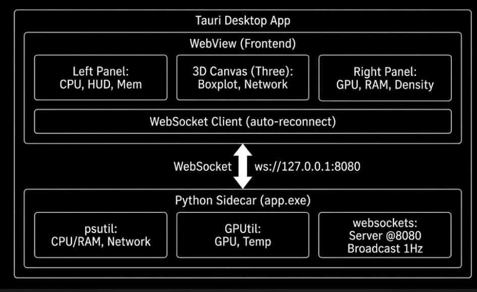

# 🛸 Orbit System Manager

[](https://github.com/ryantr-statinops/task_manager_3D_visualize/releases)

**Ứng dụng giám sát hệ thống thời gian thực với trực quan hoá 3D CPU, RAM, GPU và Network**


Orbit System Manager là desktop app giám sát hiệu năng hệ thống theo thời gian thực. Sử dụng **trực quan hoá 3D** hiển thị tải CPU dưới dạng topology động, kết hợp biểu đồ thống kê (boxplot, density plot, time‑series) và HUD hiển thị thông số chi tiết.

---

## 📥 Tải & Cài đặt

### Cách 1: Download từ GitHub Releases (khuyên dùng)

1. Truy cập **[Releases](https://github.com/ryantr-statinops/task_manager_3D_visualize/releases)** của repo này
2. Tải file mới nhất:
   - **`Orbit-System-Manager_x64-setup.exe`** — dành cho Windows (NSIS installer)
3. **Double-click** file vừa tải → chạy trình cài đặt
4. Sau khi cài xong, app sẽ có trong **Start Menu** 🎉

> **Lưu ý:** Windows Defender có thể hiện cảnh báo "Windows protected your PC". Nhấn **"More info"** → **"Run anyway"** để tiếp tục.

### Cách 2: Tải Portable (không cần cài đặt)

Trong mục **Releases**, tải file `.zip` và giải nén, chạy `Orbit System Manager.exe`.

---

## 🚀 Hướng dẫn sử dụng

### Khi app khởi động

App sẽ tự động:
1. Mở cửa sổ desktop với giao diện 3 cột
2. Kết nối WebSocket đến backend thu thập dữ liệu hệ thống
3. Nếu không có backend, app tự động dùng **dữ liệu giả lập** — bạn vẫn xem được đầy đủ demo

### Các thao tác chính

| Thao tác | Mô tả |
|---------|-------|
| **🖱️ Kéo thả splitter (gạch dọc)** | Resize 3 cột, kích thước được lưu tự động |
| **◀▶ Nhấn nút mũi tên trên thanh top bar** | Ẩn/hiện panel trái và phải |
| **🔄 Xoay 3D** | Giữ chuột trái + kéo trên canvas 3D |
| **🔍 Zoom 3D** | Lăn chuột trên canvas 3D |
| **📌 Pan 3D** | Giữ chuột phải + kéo |

### Giao diện

**Panel trái (bên trái):**
- **System Memory** — thanh RAM tổng quan + dung lượng đã dùng
- **CPU Cores** — 16 lõi CPU với thanh tải % + sparkline 40 mẫu
- **HUD** — Avg utilization, std dev, variance, kết nối real-time

**Trung tâm (Canvas 3D):**
- CPU topology 3D — mỗi cột là một lõi CPU, cao/thấp theo tải
- Boxplot + stripplot phân bố tải 16 lõi
- RAM time‑series (30 giây)
- Network chart (Sent / Received)

**Panel phải (bên phải):**
- **GPU0 / GPU1** — Density plot + Time‑series (load %, VRAM, temperature)
- **RAM Time‑Series** — biểu đồ đường RAM 30 giây
- **Network** — Sent / Received (KB/s)

---

## 🔧 Yêu cầu hệ thống

| Yêu cầu | Tối thiểu |
|---------|-----------|
| **Hệ điều hành** | Windows 10 / 11 (64-bit) |
| **RAM** | 2 GB |
| **GPU** | Không bắt buộc (có càng tốt để xem GPU charts) |

---

## 🏗️ Tổng quan kiến trúc




### Công nghệ sử dụng

| Thành phần | Công nghệ |
|-----------|-----------|
| **Desktop shell** | [Tauri v2](https://tauri.app) (Rust) |
| **Frontend** | Vanilla JS + [Three.js](https://threejs.org) |
| **Backend** | Python + [websockets](https://websockets.readthedocs.io) |
| **System metrics** | [psutil](https://github.com/giampaolo/psutil) + [GPUtil](https://github.com/anderskm/gputil) |
| **Bundler** | [Rollup](https://rollupjs.org) |

---

## ⚙️ Dành cho nhà phát triển

> Phần này dành cho ai muốn build source từ code.

### Yêu cầu

| Công cụ | Phiên bản |
|---------|-----------|
| [Python](https://www.python.org) | ≥ 3.9 |
| [Node.js](https://nodejs.org) | ≥ 18 |
| [Rust](https://www.rust-lang.org) | ≥ 1.77 |
| OS | Windows 10/11 |

### Cài đặt & Build

```bash
# 1. Clone repo
git clone https://github.com/ryantr-statinops/task_manager_3D_visualize.git
cd task_manager_3D_visualize

# 2. Cài Python dependencies
pip install -r requirements.txt

# 3. Cài npm dependencies
npm install

# 4. Build frontend
npm run build

# 5. Build desktop app (ra file .msi / .exe)
npm run build:app
```

File cài đặt sau khi build sẽ nằm tại:

| Định dạng | Đường dẫn |
|-----------|----------|
| 📦 **MSI** | `src-tauri/target/release/bundle/msi/` |
| 📦 **NSIS** | `src-tauri/target/release/bundle/nsis/` |

### Chạy chế độ development

```bash
npm run dev
```

Lệnh này sẽ tự động mở cửa sổ desktop app, load frontend từ dev server.

---

## 📁 Cấu trúc thư mục

```
task_manager_3D_visualize/
├── src-tauri/           # Tauri (Rust) — desktop app
├── src/                 # Frontend source (JS modules)
│   ├── index.js         # Entry point
│   ├── state.js         # Global state
│   ├── ui.js            # Charts, HUD, layout
│   ├── threeScene.js    # 3D CPU topology (Three.js)
│   ├── timeSeries.js    # Time‑series data structures
│   ├── websocket.js     # WebSocket + mock fallback
│   └── constants.js     # Constants
├── assets/images/       # Screenshots & assets
├── app.py               # Python backend
├── index.html           # Entry HTML
├── style.css            # Styles
└── package.json         # npm scripts & dependencies
```

---

## 🐞 Xử lý sự cố

| Vấn đề | Giải pháp |
|--------|-----------|
| 🛡️ **Windows Defender chặn** | Nhấn **"More info"** → **"Run anyway"** |
| ❌ **App mở ra nhưng trắng** | Tắt và mở lại app, hoặc restart máy |
| 📊 **Không có dữ liệu GPU** | Máy không có GPU NVIDIA hoặc không hỗ trợ — các charts khác vẫn hoạt động |
| 🔌 **Mất kết nối** | App tự động reconnect, nếu lâu quá thì restart app |
| 💾 **Dung lượng RAM hiển thị sai** | App dùng dữ liệu từ `psutil`, dung lượng được tính theo hệ nhị phân (1 GB = 1024³ bytes) |

---

## 📄 Giấy phép

MIT
